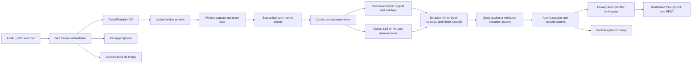
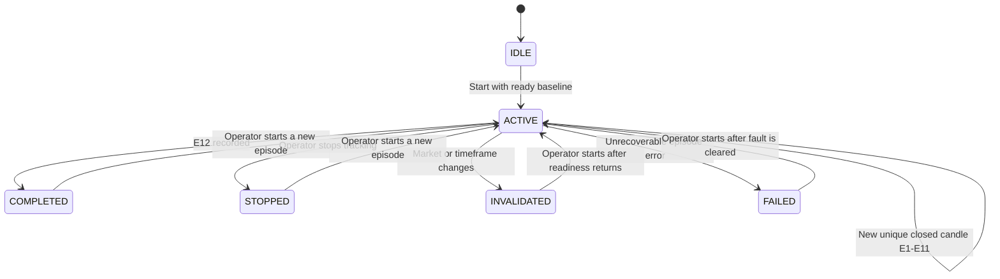

# PhoenixGuard Live Tracking Blueprint

Status: canonical live-runtime and tracking-episode blueprint
Updated: 2026-07-19
Runtime profile: `FINAL_LIVE`
Canonical session: `pocket-live-8788`

This document explains the active PhoenixGuard system from launch to the operator dashboard. It is
the current source of truth for live tracking episodes. The broader subsystem inventory remains in
[PhoenixGuard Complete System Blueprint](PhoenixGuard_System_Blueprint.md).

## The episode answer in plain language

An episode is one fixed before-and-after study of **12 newly completed candles**. It is not one
screen capture, one dashboard refresh, or one prediction call.

- The episode ID should remain unchanged while `E1` through `E12` accumulate.
- A screen capture does not advance the episode by itself.
- A moving, still-open candle does not advance the episode.
- Only a new, confirmed, unique closed candle advances the cursor once.
- On an M5 chart, 12 closures normally require about 60 minutes, plus bounded capture and processing
  delay.
- At `E12`, the current implementation marks the episode `COMPLETED`. It does not automatically
  create Episode 2; the operator must press **Start tracking** again.

Therefore, seeing the same Episode 1 for one hour can be correct **if its progress moves toward
12/12**. Remaining at 0/12 or 1/12 for the whole hour is not correct.

The 2026-07-18 live run was the faulty case. Capture and analysis continued, but the closed-candle
identity resolver stopped confirming rollovers and the episode remained at E1. The detailed incident
record and hardening design are included below.

## 1. Mission and operating contract

PhoenixGuard is a local-first computer-vision market tracking workstation. It watches one locked
broker chart, reconstructs chart state from screenshots, follows the chart through time, compares
forecasted movement with completed candles, and presents a clear operator story:

1. **Current movement** — what price is doing now.
2. **Likely next** — the bounded forecast, with uncertainty.
3. **Entry status** — whether entry is permitted now, or why the operator must wait.

Its main contract is separation of responsibility:

- Computer vision observes and anchors chart objects.
- Forecast models describe possible future movement.
- Overlays explain evidence on the chart.
- The playbook and Model Council evaluate the complete market context.
- The permission contract independently decides whether an entry is allowed.
- No overlay, raw BUY/SELL label, forecast, confidence score, or history match authorizes a trade.

The normal safe state is `WAIT`. Even when a direction is likely, the public interface must still
distinguish analysis from permission. For a permitted SELL, the operator is told to prefer the
higher-price part of the entry area; for a permitted BUY, the lower-price part. This guidance never
overrides invalidation, freshness, or entry-window gates.

## 2. The clocks that must not be confused

| Clock | Typical timing | What it does | Does it advance E1-E12? |
| --- | --- | --- | --- |
| Capture scheduler | 30-second launcher default; adaptive scheduling may run sooner | Captures the locked broker window and starts one non-overlapping study | No |
| Atomic analysis commit | Once per accepted study result | Publishes an exact-frame chart, overlays, model state, council state, and operator projection | No, unless it contains a new confirmed closed candle |
| Closed-candle event | Determined by detected timeframe; M5 is about five minutes | Creates the next actual observation used to score the frozen forecast | Yes, once |
| Dashboard delivery | Server-sent event with HTTP fallback | Refreshes the visible state without recomputing truth in the browser | No |
| Manual forecast action | Asynchronous and separately polled | Runs Predict or Show future against an immutable chart snapshot | No |

Repeated screenshots of the same open candle are deliberately deduplicated. A healthy tracker can
therefore analyze many frames while the episode cursor remains unchanged between genuine candle
closures.

## 3. End-to-end system flow



The browser is a renderer and command surface. It does not own market truth, forecast truth,
permission, or episode progression.

## 4. Canonical launcher and live process topology

The only canonical full live launcher is:

```powershell
powershell -ExecutionPolicy Bypass -File .\Backend\launch\launch_phoenixguard_live_ready.ps1 -NoBrowser -WarmupSeconds 20
```

It performs the following bounded sequence:

1. Resolves the project-local `.venv-live` Python environment.
2. Bounds numerical-library threads so model workers do not exhaust VS Code or the workstation.
3. Sets `runtime/live` as runtime output and `runtime/live/data_live` as live data.
4. Enables live evaluation while disabling direct live broker clicks.
5. Stops only recognized PhoenixGuard processes and owned PhoenixGuard ports.
6. Removes ephemeral V3 runtime state without deleting the durable episode archive.
7. Runs single-environment and V3 integrity preflight checks.
8. Starts the disk-growth guard.
9. Delegates to `Backend/launch/start_phoenixguard_full_local.ps1`.
10. Waits for artifacts and session readiness.
11. Runs runtime-trace and single-topology certification.

| Process | Active responsibility | Explicit non-responsibility |
| --- | --- | --- |
| 24/7 tracker orchestrator | Owns API lifecycle, creates/locks/starts the session, monitors liveness | Does not make trade permission in the launcher |
| FastAPI mobile API | Owns session state, capture service, public APIs, dashboard, and mutations | Browser state is not its storage authority |
| Session capture worker | Captures and analyzes one locked broker surface without overlapping studies | A capture is not automatically a candle event |
| Package reporter (`shooter.py`) | Reports accepted allowance-package handshakes | Does not click the broker in `FINAL_LIVE` |
| MT4 file bridge | Validates and transfers eligible file-based handoffs when enabled | Does not weaken packet validation |
| Disk-growth guard | Keeps bounded runtime artifacts from growing without limit | Does not delete durable history indiscriminately |

Default local addresses:

- API: `http://127.0.0.1:8793`
- Dashboard: `http://127.0.0.1:8793/v3/mobile/window-tracker/dashboard/pocket-live-8788`
- Session: `pocket-live-8788`

The broker chart is an external source and must be open and visible. If no window matches the broker
query, the API and dashboard can be healthy while capture readiness correctly remains blocked. In
that state, open the configured broker chart and let the existing worker reacquire it; do not lock the
tracker to the PhoenixGuard dashboard itself.

`PHOENIXGUARD_LIVE_EXECUTION_ENABLED=1` enables live evaluation and permission-state construction.
It does not override `PHOENIXGUARD_ALLOW_LIVE_BROKER_CLICKS=0`; the latter keeps the direct click path
disabled in the canonical launcher.

## 5. Capture, crop, and source lock

Each live study follows this order:

1. Resolve the locked broker window handle.
2. Capture the complete broker window.
3. Apply the saved focus region or derive the chart study plane.
4. Record the window and chart-plane hashes.
5. Confirm that the market, timeframe, window, and chart source remain consistent.
6. Reject or fail closed when the source is missing, stale, changed, or ambiguous.

The system keeps two coordinate spaces:

- **Window space** for the complete broker surface and broker controls.
- **Chart space** for candles, zones, trendlines, structures, and forecasts.

Every chart overlay must be mapped through the exact frame's chart bounds before it is drawn on the
window image. Mixing an overlay from one frame with an image from another is prohibited. If the chart
pixels have not changed, the system publishes a no-new-evidence/WAIT state rather than pretending a
new forecast was made.

Primary implementation:

- `Backend/src/phoenixguard/mobile_api/window_tracker.py`
- `Backend/src/phoenixguard/vision/broker_source_lock_v3.py`
- `Backend/src/phoenixguard/vision/candle_palette_v3.py`

## 6. Computer-vision reconstruction

The window-tracking adapter converts the chart image into a normalized market scene. Its active
responsibilities include:

- Detecting the market and timeframe from the broker surface.
- Finding chart bounds while excluding broker chrome.
- Detecting and tracking visible candles.
- Estimating the current forming candle and the latest closed candle.
- Reconstructing global, local, impulse, pullback, retest, and continuation structure.
- Finding support/resistance and supply/demand areas.
- Anchoring support, resistance, and inner trendlines to detected candle geometry.
- Detecting entry, target, invalidation, and opposing-force areas.
- Producing internal market-context tags used by the playbook.
- Resolving a stable closed-candle key and monotonically increasing sequence.

Computer vision is allowed to say that evidence is incomplete. It must not invent a candle event to
keep an episode moving. When geometry cannot be trusted, the correct behavior is degraded/unknown,
not false certainty.

## 7. Market objects and overlay contract

The canonical overlay pipeline is:

```text
raw detections
  -> normalized V3 aliases and object types
  -> candle-anchored geometry
  -> clipping, merging, label collision, and truth audit
  -> exact-frame renderables
  -> operator-safe family/type toggles
```

The dashboard groups technical objects into plain operator families while retaining canonical names
internally:

| Public family | Main internal evidence | Default behavior |
| --- | --- | --- |
| Price structure | current candle, impulse, pullback, retest, continuation | Visible in live context |
| Key areas | demand, supply, support, resistance, opposing force | Visible when relevant |
| Trend guides | support, resistance, and inner trendlines; angle vectors | Toggleable and candle-anchored |
| Entry plan | trigger, preferred entry, target, invalidation | Visible only with valid geometry and context |
| Order positioning | lower-price buy, higher-price sell, upside/downside confirmation, plan failure | Frozen at Start; each valid area remains independently toggleable |
| Future blocks | 12 LSTM/Scene candle blocks and bounded progression | Toggleable; never drawn as a misleading single line |
| History | replay entry/exit and prior progression | Ghosted and non-authoritative |
| Diagnostics | raw detection, rejected/stale geometry, transform and anchor debug | Hidden outside Diagnostics mode |

Aliases are normalized into the V3 contract. Internal strategy tags may support scoring, but the
normal frontend uses plain English and does not expose backend telemetry or private strategy
vocabulary. Toggle state changes visibility only; it never changes execution trust.

At Start, verified structure may produce rule-derived limit, closed-confirmation stop-entry, and
protective-invalidation candidate areas. Raw supply/demand or a strategy label cannot create a
stop-entry area by itself. The candidate plan is fingerprinted and frozen. Later chart scroll or
rescale is handled only through one residual-bounded transform fitted from at least three stable
closed-candle IDs; no individual moving source box is allowed to drag a frozen area. If that fit is
not proven on a frame, the frozen positioning layer is hidden rather than guessed. This is currently
a deterministic, reviewable mapper and annotation foundation—not a newly trained localization
model.

Primary implementation:

- `Backend/src/phoenixguard/vision/v3_overlay_contract.py`
- `Backend/src/phoenixguard/vision/overlay_geometry.py`
- `Backend/src/phoenixguard/tracking/market_object_tracker_v3.py`
- `Backend/src/phoenixguard/vision/market_registry.py`
- `Frontend/dashboard/static/window_tracker_dashboard.html`

## 8. Forecast and intelligence lanes

PhoenixGuard deliberately uses independent contributors so one model cannot silently become the
whole story.

| Lane | Output | Lifecycle | Authority |
| --- | --- | --- | --- |
| Scene forecast | Structure-aware future steps tied to a confirmed closed candle | Automatically cached per candle and reanchored to newer display frames | Advisory evidence |
| LSTM sequence | Twelve future OHLC-style candle blocks | Automatically available when the upgraded model is warm and valid | Advisory evidence |
| High-frequency/two-candle study | Near-term movement context | Updates with the live scene | Advisory evidence |
| Visual memory | Similar historical situations and projection artifacts | Used by the automatic pipeline and explicit Predict/Show future actions | Advisory evidence |
| Decision kernel | Market regime, location, path, and timing synthesis | Re-evaluated on accepted live state | Council input |
| Book strategy and Playbook AI | Applies the system's trained trading rules to the full evidence set | Evaluates current truth and maturity | Strategy authority input, not packet authority by itself |
| Model Council | Reconciles contributors, stability, risk, and permission gates | Session-scoped; resets maturity on context changes | Can publish studies; executable handoff still requires packet validation |

The LSTM presentation contract is future **candle blocks**, not a decorative trend line. Forecast
blocks must preserve uncertainty and must disappear or degrade when their source frame, market,
timeframe, or geometry is no longer valid.

Manual **Predict** and **Show future** actions are a separate asynchronous lane:

1. The server snapshots an immutable chart/frame identity.
2. One bounded worker runs the requested forecast/memory action.
3. The dashboard polls the action ID.
4. A late or superseded result is rejected instead of being attached to a newer chart.
5. The result always remains non-authoritative for trading.

## 9. Decision, playbook, and permission boundary

The decision chain is:

```text
observed scene + forecast contributors + market history
  -> decision kernel
  -> professional plan and book/playbook evaluation
  -> Model Council study
  -> opportunity maturity and runtime integrity gates
  -> allowance package
  -> validated PG_EXECUTION_PACKET_V3
  -> external handoff/reporting boundary
```

Rules that cannot be bypassed:

- Direction is not permission.
- Confidence is not permission.
- An entry overlay is not permission.
- A study packet is not permission.
- History matching is not permission.
- Only a fresh, validated `PG_EXECUTION_PACKET_V3` with an accepted allowance package can cross the
  execution boundary.
- `FINAL_LIVE` keeps direct local broker clicking disabled; the shooter process is a package
  reporter.

The operator dashboard consumes a separate public permission contract. It must fail closed when the
packet is absent, stale, contradictory, outside the entry area, or blocked by integrity checks.

## 10. Tracking-episode lifecycle

### 10.1 State machine



`ARMING` is a recognized persisted state for lifecycle safety, but the current successful Start path
validates readiness and creates the episode directly as `ACTIVE`.

### 10.2 Readiness before Start

Start is accepted only when the system has:

- A running tracker and valid focus/external source.
- A complete committed frame.
- A confirmed market and timeframe.
- A confirmed latest-closed-candle identity.
- A full 12-step Scene or LSTM baseline.
- A committed current plan and safe operator context.

If those inputs are incomplete, Start fails with explicit reasons. It must not construct a partial
episode that later looks authoritative.

### 10.3 What Start freezes

Start creates a unique episode ID and freezes the before-state:

- Market and timeframe identity.
- Start frame and latest closed-candle anchor.
- Committed trading plan/thesis.
- Scene, LSTM, and memory baselines.
- Start-time permission snapshot.
- Rule-derived order-positioning areas, their structural sources, and stable candle-anchor snapshot.
- Twelve-event horizon.

The frozen baseline prevents the system from rewriting its original prediction after every moving
candle.

### 10.4 What continues updating

While the baseline remains fixed, these live facts continue to update:

- Current forming-candle movement.
- Exact chart image and valid overlays.
- Display reprojection of frozen order areas when a global closed-candle fit is proven.
- Freshness and source-lock health.
- Newly completed actual candles.
- Predicted-versus-actual event scores.
- Forecast belief/stability evidence.
- Live risk and public permission.
- An advisory candidate revision, clearly separated from the committed plan.

Live permission may become safer or more restrictive as price moves; that does not rewrite the
episode's recorded before-state.

### 10.5 How E1-E12 advances

For every atomic capture commit, `advance_tracking_episode_v1` checks:

1. Is the episode `ACTIVE`?
2. Is the market/timeframe still the same?
3. Is there a confirmed closed-candle key?
4. Is it different from every processed key?
5. Is its sequence strictly newer?

If all checks pass, exactly one event is appended. The event records the actual candle, the matching
baseline forecast step, direction agreement, comparable displacement error, and updated progress.
Duplicate frames and forming-candle movement do not append events.

At E12, the episode becomes `COMPLETED` and its complete before/after record is retained. The current
implementation does not auto-chain a new episode.

### 10.6 Stop behavior

**Stop tracking** stops only the episode:

- State becomes `STOPPED`.
- Baseline, events, and history remain available.
- The capture worker stays warm.
- Models stay warm.
- The live market story and overlays may continue to update.
- A capture already in flight cannot reopen or erase the stopped episode because the episode is
  reloaded inside the same commit lock.

This is intentionally different from stopping the entire tracker or shutting down the stack.

## 11. Atomic publication and stale-write protection

One session commit lock binds together the exact frame's:

- Source and chart identities.
- Chart/window artifacts.
- Overlay geometry and truth audit.
- Forecast contributors.
- Model Council result.
- Public session state.
- Tracking-episode transition.

Atomic JSON replacement prevents readers from seeing half-written state. `SessionAtomicWriterV3`
rejects stale writers so an older, slow model result cannot overwrite a newer frame. Artifact URLs are
versioned by frame identity, not by arbitrary browser timestamps.

## 12. Public operator workspace and dashboard

`PG_OPERATOR_WORKSPACE_V1` is the privacy and comprehension boundary between the live backend and the
dashboard. It projects only what the operator needs:

- Market and timeframe.
- Current movement.
- Likely next movement and uncertainty.
- Independent entry permission and blocking reason.
- Tracking status, E1-E12 progress, and retained history.
- Freshness.
- Exact-frame full-window/chart media.
- Normalized safe overlays and toggle metadata.

It removes model-provider internals, file-system details, raw diagnostics, backend telemetry, and
private strategy language. The dashboard requests one exact-frame bundle and filters beginner,
professional, overlay, and history views locally without changing backend truth.

Dashboard interactions:

- Start/Stop controls mutate the episode, not the model processes.
- Overlay family and type controls show every valid canonical overlay without changing authority.
- Labels can be on, on-hover, or off.
- Fit and zoom apply the same transform to image and overlays.
- Session History can inspect retained events; history is ghosted and never changes current
  permission.
- Market Story updates from the live operator workspace rather than static frontend wording.
- SSE pushes state changes; bounded HTTP refresh is the fallback.

## 13. Persistence and history

### Ephemeral live state

The current live session is stored below:

```text
runtime/live/data_live/mobile_api/window_tracker/sessions/pocket-live-8788/
```

Important live artifacts include:

```text
session.json
compact_live_state.json
display_state.json
events.jsonl
tracking_episode_state.json
tracking_episode_events.jsonl
chart/window/overlay artifacts
```

The launcher may clean these ephemeral files during a full restart.

### Durable episode archive

Episode before/after records are also stored beneath:

```text
data/mobile_api/window_tracker/tracking_episode_archive_v1/sessions/<session>/
```

The durable archive contains per-episode records, history, and an event ledger. It intentionally
survives live-runtime cleanup. Retention is bounded to the most recent 24 episodes per session, 32
session directories by default, 64 MiB total by default, 1 MiB per record, and a byte/line-bounded
ledger. The active session is never selected by global pruning; oldest inactive sessions are
permanently deleted without archive or quarantine copies. Public history is a sanitized summary, not
a dump of private model geometry.

## 14. Key public endpoints

All paths below use `http://127.0.0.1:8793`.

| Method and path | Purpose |
| --- | --- |
| `GET /v1/mobile/health` | API health |
| `GET /v1/mobile/window-tracker/sessions/{id}` | Current public tracker session |
| `POST .../sessions/{id}/start` | Start the capture tracker |
| `POST .../sessions/{id}/stop` | Stop the capture tracker |
| `POST .../sessions/{id}/capture-once` | Request one capture |
| `GET .../sessions/{id}/artifacts/latest-window` | Exact current broker-window image |
| `GET .../sessions/{id}/artifacts/latest-chart` | Exact current chart image |
| `GET .../sessions/{id}/artifacts/latest-overlay` | Exact current rendered overlay artifact |
| `GET /v1/mobile/operator/state/v1/{id}?view=all` | Privacy-safe operator workspace |
| `GET .../sessions/{id}/events` | Server-sent session updates |
| `GET .../sessions/{id}/tracking-episodes/readiness` | Start-readiness contract |
| `GET .../sessions/{id}/tracking-episodes/current` | Current and retained episode state |
| `POST .../sessions/{id}/tracking-episodes/start` | Freeze a new 12-event baseline |
| `POST .../sessions/{id}/tracking-episodes/stop` | Stop only the active episode |
| `POST .../sessions/{id}/predict` | Queue a manual prediction/memory action |
| `POST .../sessions/{id}/show-future` | Queue a future-projection action |
| `GET .../sessions/{id}/forecast-actions/{request_id}` | Poll the immutable forecast action |
| `GET /v3/mobile/window-tracker/dashboard/{id}` | Canonical dashboard |
| `GET /v1/mobile/runtime/trace/v3?session_id={id}` | Runtime authority/integrity trace |

## 15. What happened in the one-hour incident

Persisted evidence from 2026-07-18 shows two unhealthy episodes:

| Run | Duration | Frames/captures | Episode progress |
| --- | --- | --- | --- |
| Earlier run | About 65 minutes | Tracker remained live | 0/12 |
| Later run | 18:55:09-19:56:48 local time | Anchor frame 73 through final frame 163 | E1 recorded at 19:00:18, then remained 1/12 |

The later run proves the tracker itself did not sleep: roughly 90 subsequent frame studies were
committed. The problem was specifically event identity.

Late frames repeatedly reported:

```text
closed_candle_transition_observed = false
closed_candle_transition_reason = AMBIGUOUS_SCREENSHOT_REUSES_EVENT
geometry_projection_status = DEGRADED_REANCHOR
geometry_projection_reason = DETECTOR_COVERAGE_DEGRADED
```

Detected candle coverage also shifted from roughly 74 candles to 65. The resolver retained the same
closed-candle key and sequence instead of confirming another closure.

### Root cause

The screenshot does not provide a native broker bar ID or open timestamp. The current resolver can
advance when the source identity changes or when the immediately previous forming candle can be
matched visually as the new latest-closed candle. If one rollover is missed while coverage or
geometry changes, the saved forming reference can become stale. Later candles then fail the match
threshold, and the safety path keeps reusing the stale event rather than fabricating a new one.

That fail-closed behavior prevents double-counting, but it can currently become an indefinite
identity deadlock. Existing tests cover a clean one-step rollover; they do not fully cover recovery
after a missed rollover and multi-candle drift.

Restarting clears the immediate ephemeral stale state, but it does **not** by itself remove this
algorithmic risk.

## 16. Required continuity hardening

The safe professional correction should preserve the frozen 12-event study while adding bounded
recovery:

1. Prefer a broker-provided bar ID/open timestamp whenever an authenticated source supplies it.
2. Add a timeframe-aware identity watchdog. If no event arrives after the expected closure window,
   enter `REACQUIRING` instead of silently displaying E1 forever.
3. Reacquire from multiple consecutive visual observations, not one screenshot.
4. Use time boundaries only as eligibility evidence; require visual/source corroboration.
5. Record missed intervals as `UNKNOWN/GAP` rather than inventing candle outcomes.
6. Re-anchor the candle sequence after detector dropout without counting the same candle twice.
7. Show the operator **Reacquiring candle timing** and preserve the last trusted progress.
8. When E12 completes, optionally auto-start a fresh episode while a master Tracking toggle remains
   enabled; stopping the toggle must still retain memory and keep models warm.
9. Add tests for missed rollovers, detector coverage loss, multi-bar drift, restart recovery,
   no-double-count, pair/timeframe invalidation, in-flight Stop, and automatic episode chaining.

Until that hardening is implemented, an active episode that exceeds the expected horizon without
cursor movement must be treated as degraded tracking, not successful completion.

## 17. Verification and acceptance

### Clean launch

```powershell
powershell -ExecutionPolicy Bypass -File .\Backend\launch\launch_phoenixguard_live_ready.ps1 -NoBrowser -WarmupSeconds 20
```

### Topology proof

```powershell
.\.venv-live\Scripts\python.exe Backend\tools\certify_process_topology_v3.py `
  --base-url http://127.0.0.1:8793 `
  --session pocket-live-8788 `
  --port 8793 `
  --data-dir runtime\live\data_live `
  --require-bridge
```

### Live acceptance checklist

- Health returns HTTP 200 and status `ok`.
- Exactly one logical API/tracker stack owns port 8793.
- The tracker session is `running`.
- Capture/frame identity advances across fresh samples.
- Market and timeframe are detected and stable.
- The latest window/chart artifacts return HTTP 200.
- The operator workspace and dashboard return HTTP 200.
- Tracking readiness is explicit: ready, or blocked with concrete reasons.
- Start freezes one 12-step baseline and does not rewrite it on polling frames.
- Each genuine completed candle advances exactly one E-event.
- Duplicate captures advance zero events.
- Pair/timeframe change invalidates instead of contaminating the episode.
- Stop retains the baseline/history while capture and models remain warm.
- Overlays and their toggles remain aligned to the exact broker/chart frame.
- LSTM future output is rendered as candle blocks.
- Public UI contains no raw telemetry or private backend strategy language.
- No overlay or forecast changes entry permission by itself.

## 18. Active source map and related documents

### Active implementation

- `Backend/launch/launch_phoenixguard_live_ready.ps1`
- `Backend/launch/start_phoenixguard_full_local.ps1`
- `Backend/launch/start_phoenixguard_24_7_tracker.py`
- `Backend/src/phoenixguard/mobile_api/app.py`
- `Backend/src/phoenixguard/mobile_api/window_tracker.py`
- `Backend/src/phoenixguard/mobile_api/operator_workspace_v1.py`
- `Backend/src/phoenixguard/tracking/tracking_episode_v3.py`
- `Backend/src/phoenixguard/tracking/market_object_tracker_v3.py`
- `Backend/src/phoenixguard/decision/scene_forecast_contributor_v3.py`
- `Backend/src/phoenixguard/decision/lstm_candle_sequence_contributor_v3.py`
- `Backend/src/phoenixguard/decision/forecast_belief_tracker_v3.py`
- `Backend/src/phoenixguard/decision/order_positioning_v3.py`
- `Backend/src/phoenixguard/decision/model_council_v3.py`
- `Backend/src/phoenixguard/vision/v3_overlay_contract.py`
- `Backend/src/phoenixguard/vision/order_positioning_annotation_v3.py`
- `Backend/src/phoenixguard/vision/overlay_geometry.py`
- `Frontend/dashboard/static/window_tracker_dashboard.html`

### Reference documents

- [PhoenixGuard Complete System Blueprint](PhoenixGuard_System_Blueprint.md)
- [One-Page Architecture Map](ARCHITECTURE_MAP.md)
- [Active Execution Paths](../active_execution_paths.md)
- [Runtime Endpoint Map](../runtime_endpoint_map.md)
- [Book Strategy Master V3](../decision/BOOK_STRATEGY_MASTER_V3_IMPLEMENTATION.md)
- [Frontend State Architecture](../frontend_v4/state_architecture.md)
- [Overlay Renderer Contract](../frontend_v4/overlay_renderer.md)
- [Overlay Modes](../frontend_v4/overlay_modes.md)
- [V3 Language Constitution](../../Backend/src/phoenixguard/V3_LANGUAGE_CONSTITUTION.md)
- [Tracking Episode Lifecycle Tests](../../Backend/tests/test_tracking_episode_v3.py)
- [Order Positioning V3 Doctrine](../decision/ORDER_POSITIONING_V3_DOCTRINE.md)

Older V2 tracker documents describe historical architecture and are not the authority for the current
12-event tracking lifecycle.
