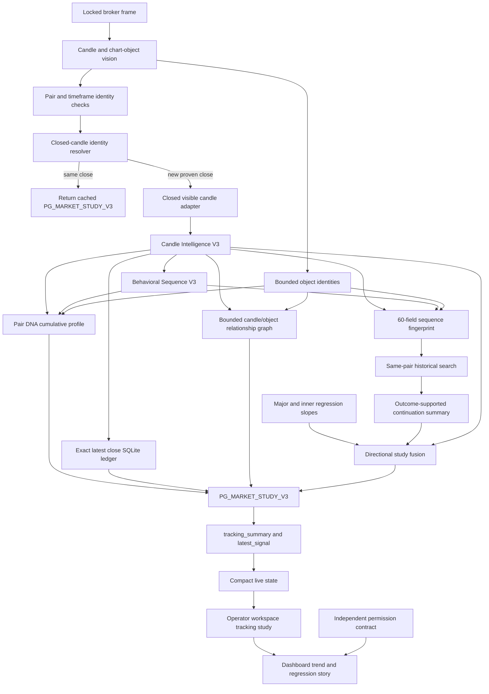

# PhoenixGuard V3 Market Study Blueprint

- Status: implemented V3 architecture and operating contract
- Updated: 2026-07-24
- Scope: candle intelligence, exact candle memory, behavioral regression, Pair DNA, object relationships, historical similarity, and operator presentation
- Version boundary: **V3 only. This is not a V4 proposal.**

This document is the implementation blueprint for PhoenixGuard's new candlestick-by-candlestick
study lane. It should be read with the
[PhoenixGuard Live Tracking Blueprint](PHOENIXGUARD_LIVE_TRACKING_BLUEPRINT.md), which remains the
canonical source for capture, 12-candle tracking episodes, permission, and live process topology.

## 1. What changed, in plain language

PhoenixGuard V3 now keeps two truths separate:

1. **Market study truth** describes what the chart has done, how individual candles behaved, how
   long swings and rests lasted, what the major and inner trends are, and whether the present
   sequence resembles prior sequences for the same pair and timeframe.
2. **Execution truth** decides whether an entry is permitted on the current fresh frame.

The study lane may produce a directional **BUY study** or **SELL study** while execution remains
`WAIT`. That is intentional. A historical resemblance, regression direction, candle personality,
object correlation, or confidence value can inform the operator, but none can grant entry
permission.

The implemented lane replaces the idea that every non-permitted situation should be described as
only `WAIT`. The frontend instead presents:

- major trend;
- inner trend;
- current behavior: swing, rest, continuation, or direction change;
- historical regression/directional study;
- entry permission as a separate compact safety status.

## 2. Hard invariants

These invariants apply to every module and payload described below.

| Invariant | Required behavior |
| --- | --- |
| V3 boundary | All schemas and implementation remain under V3 names and existing V3 routes. No V4 route, schema, or parallel product is created. |
| Closed-candle causality | Persistent study updates occur only after pair, timeframe, and a unique completed-candle identity are confirmed. Repeated frames for the same close are idempotent. |
| Forming-candle exclusion | A forming or unproven candle cannot enter the canonical candle intelligence sequence or durable memory. |
| One authoritative close | Each completed market-study call submits exactly its latest proven close to the exact candle ledger. The durable primary key is `(symbol, timeframe, candle identity)`; an overlapping or restarted observation upserts that row instead of creating another candle. |
| Exact geometry | Use measured OHLC when available. Otherwise preserve normalized proxy or pixel-proxy coordinates and disclose that coordinate space. Never present pixels as broker prices or pips. |
| Coordinate isolation | One fingerprint cannot mix `PRICE`, `NORMALIZED_PRICE_PROXY`, and `PIXEL_PRICE_PROXY` candles. Pair DNA partitions behavior aggregates by coordinate space. |
| Study-only output | Every study contract carries `study_only: true` and `execution_authority: false`. The market study also carries `can_grant_entry_permission: false`. |
| Bounded resources | Candle windows, object lists, caches, stores, graph nodes, and result lists have explicit limits. |
| Durable publication | JSON stores are validated, finite, size-bounded, locked, written to a same-directory temporary file, `fsync`ed, and atomically replaced. The exact candle ledger separately requires SQLite WAL, `synchronous=FULL`, and an immediate transaction. |
| Honest insufficiency | Missing identity, incomplete geometry, too little history, mixed evidence, and persistence failure produce explicit pending/degraded states. They do not invent a trend or match. |
| Association is not causation | Object/candle outcome statistics are historical associations. Their payload explicitly says they are not causal. |

## 3. Implemented end-to-end architecture



The browser renders server truth. It does not write the exact ledger, calculate or persist Pair DNA,
build relationship/similarity graphs, mature outcomes, grant permission, or reinterpret a forming
candle as closed.

## 4. Source map

| Component | Implementation | Responsibility |
| --- | --- | --- |
| Persistence primitives | `Backend/src/phoenixguard/study/_persistence_v3.py` | Cross-thread/process locking, bounded JSON reads, atomic durable writes. |
| Candle intelligence | `Backend/src/phoenixguard/study/candle_intelligence_v3.py` | Exact body/wick geometry, taxonomy, personality, prior-candle relation, rejection/acceptance, sequence tokens. |
| Exact candle ledger | `Backend/src/phoenixguard/study/candle_ledger_v3.py` | SQLite WAL store with one canonical micro-feature row per stable pair/timeframe/candle identity. |
| Behavioral sequence | `Backend/src/phoenixguard/study/behavioral_sequence_v3.py` | Major/inner regression, swing/rest segmentation, durations, path efficiency, transitions, market story. |
| Pair DNA | `Backend/src/phoenixguard/study/pair_dna_v3.py` | Durable pair/timeframe aggregates, bounded recent identities, object/candle outcome associations. |
| Object relationship graph | `Backend/src/phoenixguard/study/object_relationship_graph_v3.py` | Bounded observation graph with explicit candle anchors, co-presence, co-occurrence, and proven normalized overlap. |
| Historical similarity | `Backend/src/phoenixguard/study/historical_similarity_v3.py` | Explainable fixed-size fingerprints, deterministic similarity, bounded library, graphs, supported outcomes. |
| Live study coordinator | `Backend/src/phoenixguard/study/market_study_service_v3.py` | One idempotent study per proven close, prior-outcome maturation, compact public study, directional read. |
| Tracker integration | `Backend/src/phoenixguard/mobile_api/window_tracker.py` | Identity gates, close adaptation, regression context, object reduction, study invocation, safe degradation. |
| Live-state projection | `Backend/src/phoenixguard/mobile_api/live_state_v3.py` | Preserves bounded `market_study_v3` in tracking and latest-signal compaction. |
| API allowlist projection | `Backend/src/phoenixguard/mobile_api/app.py` | Projects explicitly selected nested study evidence instead of relying on a generic depth walk. |
| Tracking history attribution | `Backend/src/phoenixguard/tracking/tracking_episode_v3.py` | Attaches a compact study snapshot only when its close key and monotonic close sequence exactly match the event. |
| Operator projection | `Backend/src/phoenixguard/mobile_api/operator_workspace_v1.py` | Keeps the fixed top-level schema and projects the study inside `tracking`; history remains evidence-only. |
| Dashboard | `Frontend/dashboard/static/window_tracker_dashboard.html` | Major/inner/regression story, candle-by-candle session history, exhaustive label mode, separate permission. |

## 5. Closed-candle causality and idempotency

### 5.1 Authority chain

The causal key is not a frame number. It is the latest completed-candle event resolved for one
confirmed `(pair, timeframe)` context.

1. `resolve_closed_candle_identity_v3(...)` produces a `closed_candle_key`, monotonic
   `closed_candle_sequence`, and `PG_CLOSED_CANDLE_IDENTITY_STATE_V3` state.
2. The tracker requires confirmed market and timeframe identities and a non-empty close key.
3. Visible rows are filtered by their explicit closed/forming fields. When a detector does not label
   closure, the tracker treats the right-most candle as forming and only earlier visible rows as
   historical closed candles.
4. `adapt_tracker_candle_v3(...)` requires `proven_closed: true`, a non-empty event key, and matching
   candle identity when both the proof and row identify the candle. It validates geometry before it
   adds `is_closed: true`.
5. `analyze_candle_sequence_v3(..., require_closed=True)` rejects every row that does not contain an
   explicit closed marker. Thus the analysis module itself never infers closure from geometry or
   list position.
6. The market-study cache key is `(symbol, timeframe, closed_candle_key)`. Repeated screenshots of
   the same forming candle return the prior result without another persistence update.

The tracker requires at least five visible candles so that, under the conservative right-edge
policy, at least four proven historical candles remain for the first sequence fingerprint.

### 5.2 Resolver-to-study identity bridge

Tracker `track_id`, generic `id`, and rolling sequence index values are positional display
identifiers. They restart or shift when the visible window is reacquired and therefore are never
stable candle identity, chronological order, or persistence proof.

For a screenshot-only candle that has no stable source timestamp, the tracker may promote identity
into the study lane only when all of the following are present and consistent:

- the proof source is exactly `PG_CLOSED_CANDLE_IDENTITY_STATE_V3`;
- the resolver supplies a non-empty stable closed-candle event key;
- the resolver supplies a non-negative monotonic event sequence for the same pair/timeframe;
- the row belongs to the resolver's current confirmed event or its confirmed event batch; and
- a prior event is marked stable only after the resolver uniquely re-observes it at the exact
  predecessor position implied by the confirmed transition count on the current candle axis.

The unique prior match must clear the resolver's similarity and separation checks and form a
contiguous X-axis chain into its successor. An arbitrary shifted window, a detector reacquisition,
or a merely similar positional candle cannot manufacture this proof. The bridge adds
`identity_stable`, `stable_candle_identity`, `identity_proof_source`, and
`closed_candle_sequence` only to rows covered by that proof. All other positional rows remain valid
for bounded visual analysis but cannot enter lifelong candle counting or mature an outcome.

### 5.3 What can and cannot be persisted

- The current forming candle may remain visible on the chart, but is excluded from the canonical
  closed sequence and every durable study mutation.
- Detector refinement within the same closed-candle event may improve display geometry, but the
  market-study event remains keyed to the same causal close.
- A pair change, timeframe change, identity rebind, or missing close key produces a pending study.
- A malformed historical candle is skipped by the tracker. If fewer than four valid closed candles
  remain, the whole market study reports `INSUFFICIENT_HISTORY`.

### 5.4 Exact candle ledger

Schema: `PG_CANDLE_LEDGER_V3`

Default file: `candle_ledger_v3.sqlite3`

The ledger is the authoritative distinct-candle store. After a study has at least four valid closed
candles, the service takes only the newest studied candle, marks the proven `closed_candle_key` as
its stable identity, and submits that one row. The SQLite primary key is
`(symbol, timeframe, candle_identity)`. The result is therefore one authoritative close per study
event, even though the analyzer used a rolling window of up to 128 candles.

An insert retains the exact allowlisted source values, canonical OHLC/proxy geometry, full
body/wick measurements and ratios, taxonomy, personality, regime, relation, interaction evidence,
and sequence position. An upsert refreshes the canonical evidence and increments
`observation_count`; it does not increment `unique_candle_count`. Raw screenshots, arbitrary
detector payloads, model inputs, orders, and execution authority are never stored.

The write contract is intentionally strict:

- the candle must be `STUDIED`, explicitly closed, study-only, and non-executing;
- identity must be explicit and stable; synthetic positional names are rejected as identities;
- coordinate space and its required source fields must agree;
- one batch is validated completely before mutation, and conflicting duplicate identities fail the
  whole batch;
- service integration submits one row; the reusable ledger accepts at most 4,096 rows per atomic
  batch;
- default capacity is 1,000,000 unique rows, configurable only within 1 to 10,000,000; a capacity
  breach rolls back the entire batch;
- recent reads are bounded to 512 rows.

Every connection requires WAL mode, `synchronous=FULL`, foreign keys, a default 5,000 ms busy
timeout, and `BEGIN IMMEDIATE` for initialization and writes. A schema mismatch or a pre-existing
table without V3 schema authority requires an explicit migration; the store never silently adopts
or resets it.

## 6. Candle Intelligence V3

Schema: `PG_CANDLE_INTELLIGENCE_V3`

### 6.1 Supported coordinate sources

The geometry adapter selects exactly one representation, in this order:

1. broker/market `open`, `high`, `low`, `close` -> `PRICE`;
2. `open_proxy`, `high_proxy`, `low_proxy`, `close_proxy` -> `NORMALIZED_PRICE_PROXY`;
3. measured wick/body pixel coordinates -> `PIXEL_PRICE_PROXY`.

For pixel geometry, image Y increases downward. The module negates Y to create a local price-like
axis, but retains the original pixel values under `source_values`. If only body top/bottom is known,
the measured candle direction determines which body edge is open and which is close. Unknown
direction is rejected rather than guessed.

Every candle envelope is validated:

- all numeric fields must be finite;
- `high >= low`;
- high cannot fall below the body;
- low cannot rise above the body;
- total range must be positive;
- pixel body top cannot be below pixel body bottom.

### 6.2 Exact micro features

For a valid range `R = high - low`, the record preserves:

- body size `abs(close - open)`;
- upper wick `high - max(open, close)`;
- lower wick `min(open, close) - low`;
- body/range, upper-wick/range, lower-wick/range, and total-wick/range;
- body/total-wick and each wick/body when denominators are non-zero;
- close location within the full range;
- range relative to the sequence median;
- exact source values and canonical OHLC/proxy values.

These are measured values. A pixel-space wick is not translated into pips until a separate,
validated price-scale mapping exists.

### 6.3 Implemented taxonomy

The deterministic candle taxonomy includes:

- doji and long-legged doji;
- spinning top;
- bullish/bearish marubozu;
- upper- and lower-wick rejection;
- bullish/bearish impulse;
- bullish/bearish balanced candle;
- balanced indecision.

The personality layer adds context such as:

- liquidity rejection high/low;
- breakout acceptance up/down;
- higher/lower-price rejection;
- expansion up/down;
- compression;
- assertive or controlled buying/selling;
- indecision.

Relative behavior records inside/outside bars, higher-high/higher-low and lower-high/lower-low
relationships, mixed extensions, and overlapping ranges. Rejection checks whether the wick swept
the prior high/low and closed back inside. Acceptance requires a close beyond the prior extreme with
a body ratio of at least `0.40`.

Each candle receives a stable 16-character token derived from direction, type, personality,
relation, and regime. The full sequence signature is the SHA-256 digest of the ordered candle
tokens. The service bounds one live sequence to 128 candles; the reusable analyzer supports 512 by
default and validates caller limits up to 4,096.

## 7. Behavioral Sequence V3

Schema: `PG_BEHAVIORAL_SEQUENCE_V3`

This module describes observed behavior instead of forcing every non-entry state into `WAIT`.

### 7.1 Per-candle state

Each closed candle becomes one of:

- `UP_SWING`;
- `REST`;
- `DOWN_SWING`.

The state uses close-to-close movement normalized by the sequence median range. A candle is treated
as resting when normalized movement is at most `0.30` and its body, range multiple, or indecision
type also shows compression. This is a descriptive state, not an entry signal.

### 7.2 Segments and duration

Consecutive equal states form a segment. Every segment records:

- start/end indices and candle IDs;
- candle count and duration in seconds;
- direction and price change;
- absolute change in median-range units;
- high, low, and path efficiency;
- average body, upper wick, lower wick, and range multiple;
- prior and next state.

Duration uses actual timestamps when they parse and are monotonic. Otherwise it falls back to
`candle_count * timeframe_seconds`. Swing summaries are split into up and down. Rest summaries also
count later up breakouts, down breakouts, and unresolved rests.

### 7.3 Major and inner trends

Major and inner trend are always separate regression scopes:

- **major** uses the full bounded studied sequence;
- **inner** uses the newest eight candles, or the available shorter sequence with a minimum of two.

Each trend reports normalized slope, directional efficiency, net change, strength, and one of
`UP`, `SIDEWAYS`, `DOWN`, or `INSUFFICIENT_HISTORY`. A directional label requires normalized slope
magnitude of at least `0.08` and directional efficiency of at least `0.22`.

The current compact story is intentionally simple: major trend, inner trend, and the current swing
or rest duration.

### 7.4 Transition memory

The module builds observed counts and conditional probabilities for all transitions among
`UP_SWING`, `REST`, and `DOWN_SWING`, both candle-by-candle and segment-by-segment. Pair DNA later
accumulates these transition counts by coordinate space.

## 8. Pair DNA: durable per-pair behavioral memory

Schema: `PG_PAIR_DNA_STORE_V3`

Default file: `pair_dna_v3.json`

One profile is keyed by a SHA-256-derived identifier for canonical `(symbol, timeframe)`. This
prevents CAD/JPY M5 behavior from being silently mixed with CAD/JPY M1 or another pair.

### 8.1 Persistent profile fields

| Group | Persisted evidence |
| --- | --- |
| Identity | Pair ID, symbol, timeframe, first/last observation, update ordinal. |
| Candle population | Observation and candle counts; direction, candle-type, and personality counts. |
| Wick/body behavior | Body and wick ratio sums; rejection, acceptance, upper-sweep, and lower-sweep counts. |
| Behavioral population | State counts, segment counts, candle/duration/change sums, transition counts. |
| Trend/regime | Major trend, inner trend, and regime counts. |
| Source truth | Coordinate-space counts and coordinate-partitioned behavioral metrics. |
| Objects | Counts of bounded detected object types. |
| Outcomes | Marginal and pairwise feature association support, direction counts, success counts, and realized-return sums. |
| Bounded recency | Recent sequence summaries and recently seen sequence IDs. |
| Exact incremental boundary | One locked candle order domain, its monotonic high-water mark, completed-segment boundary high-water mark, current open segment, accepted counts, and audited skip/conflict counts. |
| Whole-sequence replay protection | Bounded exact recent ring plus segmented SHA-256 Bloom state. |

Derived reads calculate average wick/body ratios, rejection/acceptance/sweep rates, transition
probabilities, segment averages, smoothed outcome direction probabilities, success rates, and
average realized returns. These derived fields are not written back as independent authority.

### 8.2 Object and candle association features

Implemented association tokens include the latest candle type, personality, behavior state,
regime, individual object types, candle/object pairs, personality/object pairs, and pairs of object
types. The contract calls them `MARGINAL_AND_PAIRWISE_FEATURE_ASSOCIATION` and explicitly sets
`causal: false`.

At most 768 sorted feature tokens can be proposed by one matured study. Object pair construction is
bounded to the first 32 distinct sorted object types. A profile stores at most 2,048 outcome
association keys; new keys beyond that limit increment `association_overflow_count` instead of
evicting established evidence. The object-type and regime maps are separately bounded to 256 and
128 keys, respectively, with bounded overflow accounting. The compact live result publishes the
12 strongest associations by support.

### 8.3 Bounded object relationship graph

Schema: `PG_OBJECT_RELATIONSHIP_GRAPH_V3`

The current-study graph records only what one observation scope proves:

- `ANCHORED_TO_CANDLE` is a directed edge and requires an explicit object candle identity that
  exactly matches a studied candle;
- `OBSERVED_WITH` links an unanchored object to the latest studied candle because both were present
  in the same study call, but its proof explicitly says `anchor_inferred: false`;
- `CO_OCCURS` means two objects were supplied in the same observation scope;
- `OVERLAPS` exists only when both objects have valid normalized rectangles with positive
  intersection; the edge reports intersection area and intersection-over-union.

The tracker boundary preserves every distinct source object key, including real support/demand and
resistance/supply rows that previously collapsed under an empty generic identity. When the exact
chart-image width and height are available, its pixel `bbox`, touch points, or anchor-wick points
are converted once into bounded normalized evidence and the raw pixel coordinates are discarded.
Without that explicit frame size, pixel, point-only, or malformed geometry is never guessed into a
normalized overlap. An object with no source identity receives an observation-local ordinal and is
explicitly marked `OBSERVATION_ONLY`, never stable. Objects retain bounded identity scope,
direction, confidence, lifecycle, geometry, explicit/matched/unresolved candle associations, and
an evidence digest. Every edge is observational and non-causal.

The reusable graph defaults to 64 object nodes, 16 candle nodes, 512 edges, and 32 points per
object. Its absolute validated limits are 256 object nodes, 64 candle nodes, 4,096 edges, 128 points
per object, and 4,096 input rows of either kind. The live service deliberately uses tighter caps:
32 objects, eight candle nodes, 128 edges, and eight points per object after the tracker has already
reduced its object evidence to at most 64 rows. Omitted objects, candle anchors, and edges are
counted, and the graph reports `READY_TRUNCATED` rather than pretending it is complete.

### 8.4 Exact incremental counting, replay protection, and bounds

Pair DNA has two independent idempotency layers:

1. **Whole-sequence replay protection.** The newest 512 exact sequence IDs remain in a bounded
   ring. All accepted sequence IDs also enter a SHA-256 segmented Bloom design: 20 sealed segments,
   32,768 bits and 16 hashes per segment, and 512 insertions per segment. Total design capacity is
   10,240 sequence IDs per pair; the union false-positive probability across all full segments is
   below `1e-9`. At 10,240 identities it fails closed and requires sharding instead of opening an
   unsafe segment or forgetting old IDs. A safe legacy 16,384-bit/five-hash filter can be carried as
   a separately validated migration attachment.
2. **Candle and segment boundary deduplication.** Each pair/timeframe profile locks to exactly one
   chronological domain: `CLOSED_TIMESTAMP_V1` for a stable source close timestamp, or
   `TRACKER_EVENT_SEQUENCE_V3` for a resolver-proven event key plus monotonic event sequence.
   Domains are never numerically compared or mixed. Once locked, a row from the other domain is
   audited under `skipped_order_domain_conflicts` and cannot change lifelong aggregates. Within the
   selected domain, the marker must move strictly past the per-pair candle high-water mark.
   Overlapping rows, out-of-order backfills, missing/non-monotonic order, and unstable positional
   identities are audited but not counted. A segment is counted only after the following segment
   proves its end boundary and both start/end markers resolve in that same locked domain. The open
   segment and completed-boundary high-water mark prevent the same duration, transition, or swing/
   rest segment from being counted again in the next rolling window.

`observation_count` counts accepted unique study envelopes. `candle_count` and candle distributions
count only causally new stable closes selected by the monotonic boundary ledger, never repeated rows
from overlapping analysis windows. The separate SQLite `unique_candle_count` remains the
authoritative exact row count, while Pair DNA is the cumulative behavioral aggregate. A legacy
profile with historical
aggregates but no boundary ledger establishes a conservative baseline without replaying its visible
window.

The remaining profile bounds are:

- default maximum profiles: 128, configurable up to 4,096;
- exact recent sequence IDs/summaries: 512 by default, configurable up to 4,096;
- a confirmed exact duplicate returns `DUPLICATE_IGNORED`;
- a Bloom-positive ID outside the recent exact ring returns `POSSIBLE_DUPLICATE_IGNORED` and leaves
  counts unchanged;
- profile capacity never silently evicts a pair's lifelong aggregates; it fails closed and asks for
  sharding or an explicit limit increase.

## 9. Historical fingerprint and similarity engine

Fingerprint schema: `PG_SEQUENCE_FINGERPRINT_V3`

Store schema: `PG_HISTORICAL_SEQUENCE_STORE_V3`

Default file: `historical_sequences_v3.json`

### 9.1 Explainable 60-value fingerprint

The newest maximum 64 closed candles are resampled into a fixed representation:

| Component | Dimensions | Normalization |
| --- | ---: | --- |
| Price path shape | 16 | Change from first close / median range, clipped to +/-8 ranges, scaled to +/-1. |
| Close-delta shape | 8 | Close-to-close delta / median range, clipped to +/-4 ranges, scaled to +/-1. |
| Body shape | 8 | Body/range in `[0, 1]`. |
| Upper-wick shape | 8 | Upper wick/range in `[0, 1]`. |
| Lower-wick shape | 8 | Lower wick/range in `[0, 1]`. |
| Direction distribution | 3 | Bullish, neutral, bearish proportions. |
| Behavior distribution | 3 | Up swing, rest, down swing proportions. |
| Major trend | 3 | One-hot up, sideways, down. |
| Inner trend | 3 | One-hot up, sideways, down. |
| **Total** | **60** | Fixed and validated. |

The fingerprint also retains the newest 32 ordered candle tokens, unique object types, regime,
coordinate space, latest candle summary, symbol/timeframe, and optional matured outcome. A SHA-256
digest covers the immutable fingerprint core; reads reject a digest mismatch.

### 9.2 Similarity function

The current deterministic score is transparent and fixed:

| Evidence | Weight |
| --- | ---: |
| Normalized price path | 0.28 |
| Candle delta path | 0.10 |
| Body and both wick shapes | 0.22 |
| Direction and behavior distributions | 0.12 |
| Major and inner trend match | 0.08 |
| Ordered/set candle-token similarity | 0.10 |
| Detected-object Jaccard similarity | 0.05 |
| Regime agreement | 0.05 |

The live search is same-pair and same-timeframe by default, requests the best eight matches, and
requires score `>= 0.55`. The query cannot match itself. Results explain which components aligned
and name shared object types.

The optional historical graph view is distinct from the current-study object graph. It is an
undirected sequence-similarity graph over at most the newest 256 fingerprints. The reusable default
is eight edges per node and the validated caller range is one to 32. The live service requests six
edges per node at similarity `>= 0.65`, refreshes the cached graph on first use and every 12th close,
then publishes at most 64 same-pair nodes and 128 edges in its compact study. The public app
allowlist reduces that again to graph metadata and at most 24 scalar-only edges. This is an
inspection surface, not part of trade permission.

### 9.3 Bounded storage

- Default global entries: 2,048.
- Default entries per pair/timeframe: 512.
- Adding an identical fingerprint updates its outcome while preserving insertion ordinal.
- Pair overflow removes the oldest entries for only that pair/timeframe.
- Global overflow removes the oldest entries globally.
- Store validation rejects duplicates, invalid dimensions, non-finite values, schema mismatch, and
  configured-bound overflow.

Pair DNA preserves cumulative aggregates, while the historical store deliberately preserves a
bounded set of inspectable sequence examples. They have different retention contracts.

## 10. Outcome maturation and historical continuation

Outcome labels are causal and delayed by one proven candle close.

For pair/timeframe close `N`:

1. Build and search the fingerprint for sequence `N` without using an unseen future outcome.
2. Load the bounded durable pending record for `N-1` and require the current resolver event sequence
   to equal the pending event sequence plus exactly one. A replay, gap, or out-of-order event reports
   `SKIPPED_UNPROVEN_ONE_STEP_HORIZON` and cannot mature the pending record.
3. Find the prior latest candle again among the earlier candles of the **current frame**, using its
   stable source timestamp or its resolver-proven stable event identity. Positional tracker IDs do
   not qualify.
4. Require that uniquely re-observed candle and the newest candle share the current study's coordinate
   space. Compare their closes on that one current-frame axis and normalize the move by the current
   sequence median range.
5. Label it `UP` above `+0.04`, `DOWN` below `-0.04`, otherwise `REST`.
6. Set horizon to one candle and record whether the prior BUY/SELL study matched the actual side.
7. Enrich the prior historical fingerprint and merge the prior completed study into Pair DNA with
   that matured outcome.
8. Add the current fingerprint as unlabeled, ready to mature at `N+1`.

If the prior close is not re-observed on the current frame, its identity is ambiguous, or coordinate
spaces differ, maturation reports `SKIPPED_UNPROVEN_COORDINATE_CONTINUITY`. It does not compare raw
pixel or normalized-proxy values from separately scaled screenshots, label the historical
fingerprint, or update outcome associations. Successful outcomes carry
`coordinate_continuity: CURRENT_FRAME_REOBSERVATION`. This ordering prevents both current-search
leakage and chart-autoscale/pan leakage.

The pending record retains the resolver's stable identity, proof source, and event sequence needed
for that exact `+1` check. A newly reacquired or horizontally shifted pixel window without the
resolver's unique predecessor proof cannot satisfy the horizon indirectly, even if its candle
shapes resemble the pending sequence.

Historical continuation is published only when at least three selected matches have a labeled
outcome. Similarity-weighted UP/DOWN/REST probabilities use a small symmetric prior. If the top two
probabilities differ by less than `0.08`, the result is `MIXED_EVIDENCE` rather than a forced side.
Confidence combines dominant probability, mean similarity, and a bounded support factor.

The Pair DNA association view uses add-one smoothing. The historical correlation report includes
support, lift versus the pair baseline, and a 95% Wilson interval for the dominant outcome. Both are
descriptive association reports, never causal claims.

The causal pending record is persisted atomically in `pending_outcomes_v3.json`, bounded to 64
pair/timeframe entries and protected by the same cross-process lock discipline as the other JSON
study stores. Each entry retains the fingerprint plus only the evidence needed for one-step
maturation: at most 16 compact candles, 16 behavior states, 16 segments, and 16 objects, together
with the prior study side and latest candle identity/coordinate space. When a 65th pair is written,
the oldest pending ordinal is evicted; Pair DNA and the exact candle ledger are not evicted. A
restart between `N` and `N+1` can therefore reload the bounded prior study and mature it once the
next proven, same-axis close arrives.

## 11. Live Market Study service

Schema: `PG_MARKET_STUDY_V3`

`MarketStudyServiceV3` owns:

- `PairDNAStoreV3`;
- `CandleLedgerStoreV3`;
- `HistoricalSequenceStoreV3`;
- an atomic bounded pending-outcome journal plus a process-local hot cache;
- a bounded current-study object relationship graph and cached historical similarity graph;
- an idempotent result cache keyed by pair, timeframe, and closed-candle key, capped at 64 entries.

The public result is deliberately compact:

```text
PG_MARKET_STUDY_V3
|- identity: symbol, timeframe, closed key/sequence, sequence ID, observed time
|- regression: major trend, inner trend, current pressure, regime
|- candle_intelligence
|  |- counts, baseline, sequence signature
|  |- latest candle
|  `- newest 12 exact candle studies
|- candle_ledger
|  `- this-close insert/update and exact pair unique/observation counts
|- behavior
|  |- major and inner trend
|  |- current state and current segment
|  |- swing/rest summaries and transition matrix
|  `- plain-language market story
|- pair_dna
|  |- cumulative counts and rates
|  `- strongest 12 outcome associations
|- object_relationship_graph
|  |- bounded candle and market-object nodes
|  `- proven anchor, observed-with, overlap, and co-occurrence edges
|- historical_similarity
|  |- strongest eight matches
|  |- support-gated continuation
|  `- bounded historical sequence graph
|- outcome_maturation
|  `- matured, skipped-coordinate-continuity, or no-prior status
`- directional_read: BUY, SELL, or HOLD study
```

### 11.1 Directional study fusion

The directional read fuses independent descriptive votes:

- major regression: weight `0.52`;
- inner regression: weight `0.30`;
- a support-qualified historical continuation: weight `0.18`.

When no directional vote exists, the latest completed candle may provide only a very weak fallback.
Opposing votes reduce confidence. Reasons expose every included side and evidence confidence. The
result is marked `DIRECTIONAL_STUDY` or `INSUFFICIENT_EVIDENCE` and always includes
`can_grant_entry_permission: false`.

This is the operator's one studied direction, not a second execution lane and not two simultaneous
forecast routes.

## 12. Tracker, live state, operator, history, and frontend flow

### 12.1 Tracker integration

`PhoenixGuardWindowTrackingAdapter` creates the study after visible candles, global/local/current
regression slopes, major trend context, consolidation, structure boxes, historical structure, and
support/resistance zones have been calculated.

The tracker reduces chart objects to at most 64 rows. Every row starts with object type, bounded ID,
direction, and confidence. Real source `key`, `zone_id`, `object_id`, and equivalent explicit keys
remain distinct identities instead of collapsing under role/type. With the exact captured image
width and height, pixel `bbox`, touch points, and anchor-wick points are normalized once into
bounded `[0, 1]` evidence and raw pixel geometry is stripped. Without those dimensions the tracker
does not guess a normalization. Anonymous objects receive an observation-local ordinal with
`identity_scope: OBSERVATION_ONLY`; they are never advertised as stable across frames. When
actually present, rows also preserve lifecycle/first/last-seen/duration evidence and an explicit
candle or anchor-candle identity. The tracker never manufactures those fields. All graph edges are
study-only observations, never causal or executable. The tracker derives regime as
sideways, uptrend, downtrend, or transition. The completed study is placed in both:

- `tracking_summary.market_study_v3`;
- `latest_signal.market_study_v3`.

Any exception in the study lane is caught, logged, and converted to a `DEGRADED` study. It must not
interrupt capture, permission safety, or atomic session publication.

### 12.2 Live-state and operator projection

The compact live-state allowlists preserve `market_study_v3` in both tracking and latest signal.
The app does not apply the old generic recursive depth limiter to this evidence tree. Its dedicated
allowlist first requires `study_only: true` and `execution_authority: false`, then selects only
bounded identity/regression fields, candle summary and latest ratios/interactions, behavior,
support-gated historical matches/continuation, bounded similarity edges, Pair DNA counts and 12
associations, and the directional read. Raw OHLC/source pixel geometry, full fingerprints, model
inputs, persistence metadata, and arbitrary nested keys do not cross the public app boundary.

The operator workspace keeps its established fixed top-level schema and publishes the live study
under:

```text
operator_workspace.tracking.market_study_v3
```

Do not introduce a V4 route or an extra unversioned top-level market-study key. The frontend may
read the tracking study first and use a latest-signal copy only as a compatibility fallback.

### 12.3 Session history

History rows are not a list of permission decisions. A tracking event receives a compact market
study snapshot only when both its `closed_candle_key` and monotonic `closed_candle_sequence` exactly
match the study. Reacquired batches may carry a distinct study with each confirmed event. The
newest live study is never copied backward onto older events; an unproven sequence gap remains an
`UNKNOWN_GAP` without invented candle behavior. Each correctly attributed completed-candle
observation can carry or derive:

- actual candle direction;
- major trend;
- inner trend;
- regression/directional study side;
- behavior classification: movement, rest, continuation, or direction change;
- match/difference when a previously saved future block was evaluated;
- observed time and episode/candle index.

Archived tracking summaries remain neutral about execution. A saved study with no completed
candles is described as an empty regression archive, not as a permanent `WAIT` trend.

### 12.4 Frontend contract

The V3 dashboard is a chart-led study workspace:

- the forecast-control panel, Forecast navigation, dual frozen-route presentation, and public
  `two_candle`, `scene_forecaster`, `lstm`, and `prediction` overlay families are retired from the
  V3 workspace;
- retired forecast families are absent from `ALL_OVERLAY_FAMILIES`, presets, public view routing,
  tracking-plan controls, and diagnostic rendering, so `Show all` cannot re-enable them;
- one concise market story shows major trend, inner trend, and historical regression;
- current movement/rest/continuation is described without turning it into permission;
- entry permission remains a separate compact block;
- session history is titled and rendered as a candle-by-candle regression study;
- `Show all` plus `Labels on` activates `labels-show-all`: collision solving is bypassed and both
  `label-collision-hidden` and `label-policy-hidden` labels are forced visible even when they overlap
  or cluster;
- hover and reduced-label modes remain available when the operator wants less clutter.

The dashboard may derive a readable fallback from history and overlays during warm-up, but server
study fields take precedence once `PG_MARKET_STUDY_V3` is available.

## 13. Storage and persistence contract

### 13.1 Location

The study root resolves in this order:

1. explicit constructor path;
2. `PHOENIXGUARD_MARKET_STUDY_DIR`;
3. for canonical live runtime roots,
   `data/mobile_api/window_tracker/market_study_v3` under the project;
4. for isolated/test roots, a sibling `market_study_v3` directory.

This deliberately keeps lifelong study memory outside launcher-cleaned `runtime/live` output.

### 13.2 Files

```text
market_study_v3/
|- pair_dna_v3.json
|- pair_dna_v3.json.lock
|- candle_ledger_v3.sqlite3
|- candle_ledger_v3.sqlite3-wal        # SQLite-managed while active
|- candle_ledger_v3.sqlite3-shm        # SQLite-managed while active
|- historical_sequences_v3.json
|- historical_sequences_v3.json.lock
|- pending_outcomes_v3.json
`- pending_outcomes_v3.json.lock
```

Each JSON root repeats its schema version and the study/execution boundary. A JSON document larger
than 16 MiB fails closed, and encoding rejects NaN and infinity. The SQLite ledger carries both the
V3 ledger schema and SQL schema version in `ledger_meta`; its default distinct-row capacity is
1,000,000. WAL and shared-memory sidecars are SQLite implementation files, not separate sources of
truth and not files for manual editing.

### 13.3 Concurrency and durability

- For JSON stores, a path-specific re-entrant mutex serializes threads in one process.
- A JSON sidecar byte lock serializes processes: `msvcrt` on Windows, `fcntl` on POSIX.
- JSON lock acquisition has a five-second default timeout and checks every 20 ms.
- The JSON writer encodes and validates the complete replacement document first, writes a
  same-directory temporary file, flushes, calls `fsync`, and publishes with `os.replace`.
- A failed JSON write cleans up its temporary file and leaves the prior document authoritative.
- The candle ledger uses a process-local re-entrant mutex plus SQLite WAL and `BEGIN IMMEDIATE` for
  cross-process serialization. It validates the whole proposed batch and capacity before applying
  any insert or update, then commits once or rolls back completely.

No automatic repair or silent reset is attempted for malformed JSON or an incompatible SQLite
schema. Operators must preserve the bad store for diagnosis, restore a known-good copy, or run a
deliberate, versioned rebuild/migration.

## 14. Failure and degraded-state matrix

| Condition | Public study state | System behavior |
| --- | --- | --- |
| Pair/timeframe not confirmed | `PENDING` | No fingerprint or persistence mutation. |
| Completed-candle key absent | `PENDING` | Wait for causal identity; repeated frames do not fabricate an event. |
| Study root not configured | `UNAVAILABLE` | Tracker and permission continue; no lifelong study write. |
| Fewer than four valid closed candles | `INSUFFICIENT_HISTORY` | May return compact candle evidence; no sequence fingerprint. |
| Candle missing closure proof | Validation failure | Candle excluded/rejected; never silently marked closed by the study module. |
| Contradictory/non-finite geometry | Validation failure | Candle excluded or entire direct call rejected. |
| Mixed coordinate spaces | Validation failure | Fingerprint refused. |
| Stable ledger identity absent/synthetic | `SKIPPED_UNSTABLE_IDENTITY` at direct ledger boundary | Exact ledger remains unchanged; the service itself writes only a proven close key. |
| SQLite WAL unavailable, schema incompatible, lock timeout, or ledger capacity exceeded | `DEGRADED` at tracker boundary | The ledger transaction rolls back; capture, dashboard, and independent permission continue fail-safe. |
| Positional tracker ID offered as stable history identity | `SKIPPED_UNSTABLE_IDENTITY` or audited unstable-candle skip | Display analysis may continue; no ledger or lifelong Pair DNA mutation derives from the position. |
| Pair DNA receives a marker outside its locked order domain | `RECORDED` envelope with `skipped_order_domain_conflicts` incremented | Timestamp and resolver-event orders are never compared or mixed. |
| Pending/current resolver sequence is not exact `N -> N+1` | `SKIPPED_UNPROVEN_ONE_STEP_HORIZON` | Replay, gap, and out-of-order observations cannot mature an outcome. |
| Prior close not re-observed on current frame axis | `SKIPPED_UNPROVEN_COORDINATE_CONTINUITY` | No outcome label, historical enrichment, or Pair DNA outcome update. |
| No historical match above threshold | `NO_MATCHES` | Regression/candle study can still describe direction; similarity adds no vote. |
| Fewer than three labeled matches | `INSUFFICIENT_OUTCOME_SUPPORT` | No historical continuation vote. |
| Similar outcomes too close | `MIXED_EVIDENCE` | No forced historical side. |
| Pair DNA duplicate | `DUPLICATE_IGNORED` | Cumulative counts unchanged. |
| Possible Bloom duplicate | `POSSIBLE_DUPLICATE_IGNORED` | Counts unchanged to protect lifelong integrity. |
| Pair DNA candle timestamp does not advance, or segment boundary is unstable/incomplete | `RECORDED` envelope with audited skip counts | No duplicate candle, duration, segment, or transition aggregate is added. |
| Pair DNA segmented Bloom reaches 10,240 sequence identities | Capacity validation failure | Store fails closed and requests sharding; no lifelong profile is silently evicted. |
| More than 2,048 association keys | Profile remains valid | Established associations remain; unseen keys increment `association_overflow_count`. |
| Object graph exceeds live caps | `READY_TRUNCATED` | Deterministic highest-priority proven edges remain and every omission is counted. |
| Object graph has unsafe/conflicting geometry or identity | Validation failure, then `DEGRADED` at tracker boundary | No guessed anchor/overlap is published; independent capture and permission continue. |
| Pending outcome journal exceeds 64 pair/timeframe rows | Current study remains `STUDIED` | Oldest pending ordinal is evicted; Pair DNA, historical sequences, and exact candle rows remain. |
| Reacquired history event lacks an exactly matching study key and sequence | Event remains valid without a study snapshot | The newest live study is not backfilled onto the older candle. |
| Public app receives non-study authority flags or non-allowlisted nested fields | Study or fields omitted | No generic depth expansion exposes geometry, fingerprints, persistence, or model input. |
| JSON lock timeout, invalid JSON, 16 MiB overflow, or Pair DNA/historical capacity error | `DEGRADED` at tracker boundary | Log exception; capture, dashboard, and permission remain operational and fail-safe. |
| Process restart | Three JSON stores and the SQLite ledger reload; process caches reset | Exact candles, fingerprints, profiles, and bounded pending one-step maturation survive. |

## 15. Testing and operating proof

### 15.1 Implemented focused tests

| Test | Evidence covered |
| --- | --- |
| `test_candle_intelligence_service_v3.py` | Exact wick/body computation, rejection/acceptance, tracker proof requirement, pixel adaptation, malformed/forming failure. |
| `test_candle_micro_geometry_v3.py` | Tracker behavior tokens retain measured candle geometry and wick micro-events. |
| `test_candle_ledger_v3.py` | Rolling-window upserts, stable identity, pair/timeframe isolation, exact proxy/pixel evidence, restart/WAL, cross-process safety, and atomic capacity rollback. |
| `test_behavioral_sequence_service_v3.py` | Swing/rest segmentation, transitions, duration, major/inner trend, insufficient history. |
| `test_pair_dna_store_service_v3.py` | Monotonic unique-candle high-water, timestamp/resolver-event order-domain locking and conflict skips, stable completed-segment dedupe, Bloom probability/capacity, legacy migration, corruption and concurrent writes. |
| `test_object_relationship_graph_v3.py` | Proven anchors/overlap, non-causal co-presence, deterministic caps/truncation, unsafe geometry failure, and stripped trade instructions. |
| `test_historical_similarity_service_v3.py` | Fingerprint validation, scoring, bounded storage/graph, supported continuation, and correlation statistics. |
| `test_market_study_service_v3.py` | Idempotent close-key caching, exact candle-ledger integration, exact `+1` horizon enforcement, restart maturation, current-frame pixel-axis proof/skip, bounded pending journal, and no execution authority. |
| `test_market_study_tracker_bridge_v3.py` | Live resolver-to-study promotion: positional IDs stay unstable, one proven rollover creates one resolver-ordered Pair DNA candle, and an arbitrary reacquired pixel window cannot false-mature. |
| `test_market_study_operator_integration_v3.py` | Live/operator explicit nested allowlist, privacy boundary, and fixed V3 schema integration. |
| Focused `test_window_tracker_service.py` cases | Real source keys remain distinct and pixel bounds/points normalize against exact image dimensions before the study graph. |
| `test_tracking_episode_v3.py` | Exact key/sequence study attribution for live and reacquired events; unknown gaps never inherit the newest study. |
| `test_dashboard_static_contract.py` | Required V3 study and label-mode DOM/static contracts. |
| `test_dashboard_collision_playwright.py` | Exhaustive labels, retired forecast families, market-study schema use, and regression-history behavior in a browser. |
| Existing operator/live-state tests | Fixed public schemas, compact projection, privacy, history, freshness, and permission separation. |

### 15.2 Required release validation

Run focused tests first, then the complete repository suite. The final acceptance pass should prove:

1. same close key returns a byte-equivalent logical study and does not add a second exact candle or
   increment Pair DNA;
2. a new close matures only the exact preceding resolver event (`N -> N+1`) when that prior close is
   uniquely re-observed on the current frame axis; replay, gap, out-of-order, autoscale/pan, and
   missing continuity must skip;
3. process restart reloads all three JSON stores and the SQLite WAL ledger without schema drift;
4. concurrent JSON and SQLite writers do not lose increments or publish partial state;
5. overlapping windows count stable candles and completed segment transitions only once; Pair DNA
   locks one timestamp-or-resolver-event order domain and audits every cross-domain conflict;
6. segmented Bloom design remains below its declared union false-positive ceiling and fails closed
   at 10,240 identities;
7. corrupt, oversized, non-finite, incompatible-schema, and capacity-bound stores fail closed;
8. real object keys remain distinct; exact image dimensions normalize pixel bounds/points;
   anonymous objects stay `OBSERVATION_ONLY`; graph anchors/overlaps require explicit proof and all
   edges remain bounded, study-only, and non-causal;
9. live-state and operator APIs expose the same current study identity through the explicit app
   allowlist without raw geometry/fingerprint leakage;
10. one real broker rollover creates one and only one new sequence ID and exact ledger close;
11. the right-most forming candle never appears in durable candle intelligence;
12. reacquired history rows receive only an exactly matching key/sequence study snapshot;
13. `Show all` + `Labels on` leaves no collision-hidden or policy-hidden label visually suppressed;
14. retired forecast families remain absent even under `Show all`;
15. the dashboard shows major trend, inner trend, regression, and permission as separate concepts;
16. session history describes directional/rest behavior rather than defaulting every row to `WAIT`;
17. canonical `.venv-live` launch keeps one API/tracker topology and writes study data outside the
    launcher-cleaned runtime tree.

Useful focused command:

```powershell
$env:PYTHONPATH='Backend/src;Backend'
& '.\.venv-dev\Scripts\python.exe' -m pytest `
  Backend/tests/test_candle_intelligence_service_v3.py `
  Backend/tests/test_candle_micro_geometry_v3.py `
  Backend/tests/test_candle_ledger_v3.py `
  Backend/tests/test_behavioral_sequence_service_v3.py `
  Backend/tests/test_pair_dna_store_service_v3.py `
  Backend/tests/test_object_relationship_graph_v3.py `
  Backend/tests/test_historical_similarity_service_v3.py `
  Backend/tests/test_market_study_service_v3.py `
  Backend/tests/test_market_study_operator_integration_v3.py `
  Backend/tests/test_dashboard_static_contract.py `
  -q
```

The canonical live launch remains the command documented in the live tracking blueprint. A healthy
launch must expose the same `closed_candle_key` and `sequence_id` through tracker, compact live
state, operator workspace, and dashboard.

### 15.3 Release evidence collected on 2026-07-24

| Gate | Result |
| --- | --- |
| Repository regression collection | The 173-file regression baseline was executed in bounded deterministic shards: **2,191 passed** and **35 skipped**. The final inventory is 174 files because the resolver-to-study bridge regression file was added during the closing audit. |
| Final-code intelligence delta | **111 focused tests passed** after the closing audit across resolver identity, exact `N -> N+1` maturation, order-domain isolation, candle micro-intelligence, behavior, exact ledger, Pair DNA, historical similarity, object graph, operator projection, UI contracts, and tracker geometry. One stale assertion that still required the retired forecast-family mapping was corrected to assert its removal and rerun green. |
| Static quality | Ruff passed for every changed Python file; strict Pyright on every changed backend source reported **0 errors and 0 warnings**; `git diff --check` passed. |
| V3 identity | `verify_v3_integrity.py` reported **Overall: PASS** and retained V3 as the only active version. |
| Live API smoke | The `.venv-live` FastAPI runtime returned HTTP 200 for the V3 dashboard, operator workspace, compact live state, and tracker session endpoints. |
| Live browser proof | Chromium rendered the live dashboard with `simple-view labels-show-all labels-on`; **50 of 50** present labels were visible, including **44** labels carrying the policy-shadow class. |
| Retired UI proof | Live DOM contained no Forecast navigation, LSTM/scene forecast controls, Run forecast action, Show future path action, or Path A/Path B lane rows. |
| Study/history proof | Live DOM exposed Major trend, Inner trend, Regression study, separate `CLOSED` entry permission, and 29 regression-history rows. |
| Blueprint artifacts | Both architecture PDFs rendered successfully and passed metadata, text extraction, empty-page checks, and sampled-page visual inspection. |

The canonical cold launcher is intentionally destructive to `runtime/live`; it was not used for this
smoke because preserved operator artifacts were already present. Full-launch topology remains
covered by the V3 launcher/integrity and window-tracker tests, while the smoke used the production
`.venv-live` application and real HTTP/browser surfaces without deleting those artifacts.

### 15.4 Operational telemetry to retain

- study status and reason;
- symbol/timeframe/closed key/sequence ID;
- studied candle count and coordinate space;
- exact ledger insert/update/change counts, unique candle count, and total re-observation count;
- similarity match count and labeled support;
- Pair DNA observation/candle counts, timestamp/segment-boundary skip counters, Bloom insertions and
  remaining identity capacity, and association overflow count;
- outcome maturation status and coordinate-continuity proof;
- pending journal entry count/size and oldest-ordinal eviction;
- object relationship node/edge/relation counts and truncation counts;
- store read/write latency, JSON/SQLite lock timeout, file size, WAL mode, and ledger capacity;
- cache hit versus new-close computation;
- degraded exceptions without raw broker imagery or secrets.

## 16. Implemented now versus research challengers

The following boundary is deliberate. PhoenixGuard currently uses deterministic, explainable,
bounded algorithms so every displayed claim can be traced. Advanced models may compete as shadow
challengers only after they pass causal evaluation; they do not replace the implemented baseline by
name alone.

### 16.1 Implemented now

- exact candle body/wick micro geometry in price, normalized proxy, or pixel proxy space;
- candle taxonomy, personality, rejection/acceptance, and prior-candle relations;
- closed-candle-only sequence study;
- SQLite WAL exact candle ledger with one authoritative stable close per study and exact unique/
  re-observation counts;
- major/inner regression and explicit swing/rest segmentation;
- persistent bounded Pair DNA aggregates by pair and timeframe with monotonic candle high-water,
  stable segment-boundary dedupe, and segmented replay protection;
- object/candle association counts with non-causal labeling;
- bounded current-study object relationship graph with explicit anchors, observed-with,
  co-occurrence, and proven normalized-overlap edges;
- explainable 60-value normalized sequence fingerprint;
- deterministic pair-scoped nearest-sequence search and bounded similarity graph;
- one-candle delayed outcome maturation and minimum-support historical continuation;
- one BUY/SELL/HOLD directional study with a hard study/execution boundary;
- compact live-state, explicit app allowlist, exact tracking-history attribution, operator, and
  chart-led frontend contracts;
- retired public forecast families plus exhaustive `Show all` + `Labels on` label rendering.

### 16.2 Near-term hardening, still V3

1. Add rolling calibration by pair, regime, session, and horizon. Report Brier score, log loss,
   calibration error, hit rate with confidence intervals, and abstention coverage.
2. Add temporal train/calibration/test partitions with purge/embargo around overlapping windows.
   Never evaluate on a sequence whose candles overlap its retrieval bank.
3. Add session/time-of-day and verified price-scale features only when source identity and scale are
   proven.
4. Version feature definitions and migration tools before changing fingerprint dimensions or
   thresholds.

### 16.3 Research-informed shadow challengers

These are future challengers, **not claims about the current implementation**:

- A [Matrix Profile](https://www.cs.ucr.edu/~eamonn/MatrixProfile.html) challenger can discover
  motifs and discords in normalized candle-feature streams while preserving an inspectable nearest
  subsequence.
- A [learnable multivariate Matrix Profile](https://ojs.aaai.org/index.php/AAAI/article/view/38550)
  challenger can test cross-dimensional candle/object motifs and learned inter-feature structure.
  It remains an offline, leakage-controlled shadow until it beats the explainable same-pair
  baseline without weakening boundedness or auditability.
- Constrained multivariate dynamic-time-warping motif search can test whether elastic timing
  improves swing/rest matches; see the primary
  [DTW motif-search research](https://arxiv.org/abs/2009.07907). It must be bounded and compared
  against the current fixed resampling baseline.
- [MiniROCKET](https://arxiv.org/abs/2012.08791) or its
  [ROCKET](https://arxiv.org/abs/1910.13051) parent can provide a fast supervised sequence
  classifier challenger after leakage-safe offline training.
- [TS2Vec](https://arxiv.org/abs/2106.10466) can provide a self-supervised multiscale embedding
  challenger, but only a versioned, frozen encoder trained without future/test leakage may enter a
  live shadow lane.
- [Bayesian online change-point detection](https://arxiv.org/abs/0710.3742) can challenge the
  deterministic swing/rest boundary when it provides a causal online posterior rather than a
  hindsight segmentation.
- [Adaptive conformal prediction for time series](https://arxiv.org/abs/2202.07282) and
  [adaptive conformal inference under distribution shift](https://arxiv.org/abs/2106.00170) can
  challenge uncertainty calibration under regime drift. Coverage must be measured sequentially;
  conformal output still cannot grant permission.

Every challenger must publish beside the baseline with its model/data version, training cutoff,
pair/timeframe scope, latency, abstention behavior, calibration, and exact evaluation split. It is
promoted only when it improves out-of-sample decision support without weakening causality,
explainability, runtime bounds, or the independent execution gate.

## 17. Definition of done for this V3 lane

The V3 market-study lane is complete only when all of these statements are true at the same time:

- one proven close creates at most one durable study event;
- every persisted candle has explicit closure proof, a stable pair/timeframe close identity, and
  valid exact geometry; rolling windows upsert rather than duplicate it;
- screenshot positional IDs remain display-only; resolver identity persists only with
  `PG_CLOSED_CANDLE_IDENTITY_STATE_V3`, a stable event key, and monotonic event sequence;
- the operator can see major trend, inner trend, current swing/rest behavior, and the one studied
  directional read;
- Pair DNA counts only new monotonic candles and proven completed-segment boundaries inside one
  locked `CLOSED_TIMESTAMP_V1` or `TRACKER_EVENT_SEQUENCE_V3` order domain; historical examples and
  the exact candle ledger remain distinct, durable, bounded, and pair/timeframe scoped;
- an outcome matures only across an exact resolver `+1` event after its prior close is uniquely
  re-observed on the current frame axis; shifted/reacquired windows cannot substitute for proof;
- real object keys and exact-dimension-normalized geometry remain distinct; anonymous identities
  stay `OBSERVATION_ONLY`, and relationships never infer anchors, causation, or permission;
- historical continuation is unavailable until causal outcomes reach minimum support;
- every association and match can be explained from stored evidence;
- retired forecast families cannot return through `Show all`, and `Show all` plus `Labels on` really
  shows every present overlay label, even when clustered;
- session history describes what price did instead of mirroring permission `WAIT`;
- session history never attaches a same-frame study to a different close key/sequence;
- entry permission remains independent, fresh-frame gated, and fail-closed;
- the complete V3 suite and live topology checks pass without creating any V4 surface.
